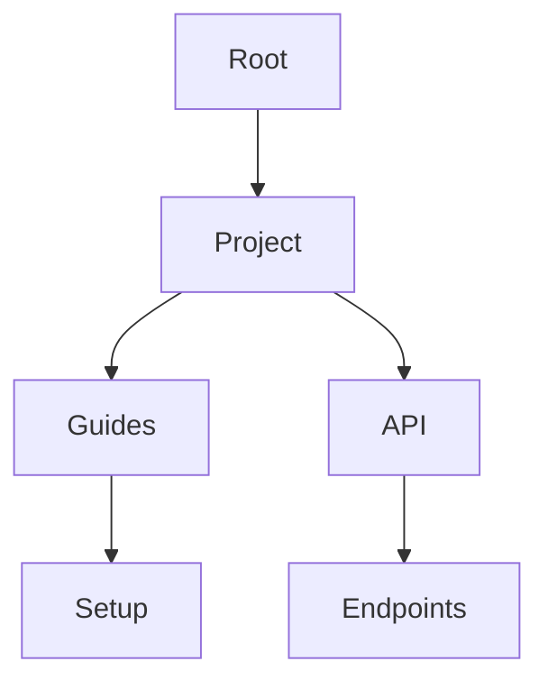

## Overview

Vincent v.B. provides a comprehensive set of tools for creating, organizing, and sharing project documentation. You can build structured knowledge bases with intuitive interfaces that support teams of any size. Key capabilities include flexible organization, rich editing, seamless collaboration, and straightforward publishing.

<Callout kind="info">
Vincent v.B. is designed as a starter kit template. Customize these features to match your specific project needs.
</Callout>

## Key Features

<Columns cols={2}>
  <Card title="Document Organization" icon="folder" href="#organization">
    Create hierarchies with folders, pages, and subpages for intuitive navigation.
  </Card>
  <Card title="Editing Tools" icon="edit-3" href="#editing">
    Rich text editor with markdown support and real-time previews.
  </Card>
  <Card title="Collaboration" icon="users" href="#collaboration">
    Real-time editing, comments, and version history for team workflows.
  </Card>
  <Card title="Publishing" icon="globe" href="#publishing">
    One-click publishing with custom domains and sharing options.
  </Card>
</Columns>

## Document Organization and Hierarchies

Organize your documentation using nested folders and pages. You define structures like `/project/guides/setup` to keep content logical and discoverable.



<Expandable title="Advanced Nesting Tips" default-open="false">

Use tags and search for cross-referencing content across hierarchies.

</Expandable>

## Editing and Formatting Options

Vincent v.B. offers a WYSIWYG editor alongside markdown support. Format text, embed images, and add code blocks effortlessly.

<Tabs>
  <Tab title="Markdown" icon="code">
    Write in familiar markdown syntax.

````markdown
# Heading

**Bold text** and _italic_.

- List item
- Another item

```javascript
console.log('Hello, Vincent v.B.!');
```
````

  </Tab>
  <Tab title="Visual Editor" icon="edit">
    Drag-and-drop components for tables and images.

    | Feature       | Benefit                  |
    |---------------|--------------------------|
    | Drag Images   | Quick embedding          |
    | Table Builder | No manual pipe syntax    |
    | Embed Videos  | YouTube/Vimeo support    |
  </Tab>
</Tabs>

## Collaboration and Version Control

Enable team editing with real-time cursors and conflict resolution. Track changes via git-like version history.

<Steps>
  <Step title="Invite Collaborators" icon="user-plus">

    Add users by email.

````javascript
// Example API call (hypothetical)
const response = await fetch('https://api.example.com/v1/teams/invite', {
  method: 'POST',
  headers: { 'Authorization': 'Bearer YOUR_TOKEN' },
  body: JSON.stringify({ email: 'team@member.com' })
});
````

  </Step>
  <Step title="Review Changes" icon="git-branch">

    Compare versions side-by-side.

  </Step>
  <Step title="Resolve Conflicts" icon="alert-triangle">

    Merge or revert as needed.

  </Step>
</Steps>

<Callout kind="tip">
Always review version history before publishing to avoid overwriting changes.
</Callout>

## Publishing and Sharing Workflows

Publish docs instantly to a live site. Share via links, embeds, or custom domains.

<CodeGroup tabs="CLI,API">
````bash
# Command-line publishing
vincent publish --domain mydocs.vincentvb.com
````
````javascript
// API publishing
await fetch('https://api.example.com/v1/docs/publish', {
  method: 'POST',
  headers: { 'Authorization': 'Bearer YOUR_TOKEN' },
  body: JSON.stringify({ docId: 'project-guide' })
});
````
</CodeGroup>

Choose visibility: public, private, or role-based access.

<Columns cols={3}>
  <Card title="Public Links" icon="share-2">
    Share read-only URLs.
  </Card>
  <Card title="Embeds" icon="code">
    iFrame for other sites.
  </Card>
  <Card title="Custom Domains" icon="globe">
    Map your domain.
  </Card>
</Columns>

These features make Vincent v.B. your go-to for scalable documentation management. Start by organizing your first project hierarchy today.